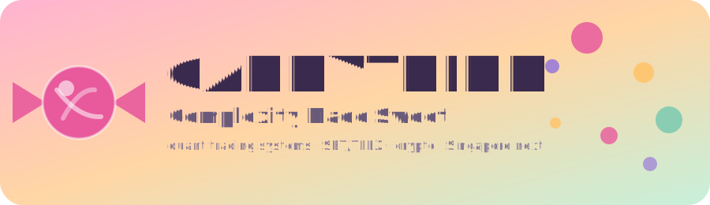

**Hi, I'm lumduan 👋** — I build quantitative trading systems, from data infrastructure to live execution, for **Thai capital markets (SET / TFEX)** and **crypto exchanges (Binance, Bitkub)**.

Self-taught since childhood — I started by scripting small tools to solve the problems in front of me, and that habit never left; it just grew in scope. Today I run a one-person quant trading operation end-to-end: home-lab + AWS active-active infrastructure, a Python execution engine trading TFEX derivatives and crypto, and the research behind it — order-flow signals, market microstructure, and risk-managed automated strategies.

  <!-- TODO: add LinkedIn badge once profile URL is provided -->
  
  
  
  

---

### 🚀 Open-source market data & tools

Free, MIT-licensed tools built to give retail investors the same quality of market access that institutions take for granted.

| Project | What it does | Status |
|---|---|---|
| [`tvkit`](https://github.com/lumduan/tvkit) | Async Python library for real-time & historical market data via TradingView |  ⭐ 11 |
| [`settfex`](https://github.com/lumduan/settfex) | Thai SET/TFEX market data access, designed for AI/LLM function-calling |  |
| [`thai-securities-data`](https://github.com/lumduan/thai-securities-data) | Free multilingual JSON API + dataset covering **900+ SET/mai** companies | served via GitHub CDN |
| [`binance-th`](https://github.com/lumduan/binance-th) | Async Python library for the Binance Thailand API |  |

### ⚙️ The quant stack — the engine family

The infrastructure behind the operation — gateway-proxied microservices with per-service, sole-credential-owner isolation (least-privilege by design):

- [`quant-marketdata-engine`](https://github.com/lumduan/quant-marketdata-engine) — canonical OHLCV store (sole tvkit-cookie owner)
- [`quant-execution-engine`](https://github.com/lumduan/quant-execution-engine) — canonical order router (sole broker-credential owner)
- [`quant-api-gateway`](https://github.com/lumduan/quant-api-gateway) — gateway-proxied entry point
- [`quant-infra-db`](https://github.com/lumduan/quant-infra-db) · `quant-ticker-engine` · `quant-orderbook-engine` · `quant-monitor` — durable L2/T&S capture & monitoring

### 📈 Live strategy

[`csm-set`](https://github.com/lumduan/csm-set) — a **cross-sectional momentum strategy on the SET**, currently in **live testing** and outperforming the market during that period.

> Backtests lie, and live P&L doesn't. I take that validation seriously.

### 🛡️ How I build

I care as much about how a system *fails* as how it performs — these aren't afterthoughts, they're how I build from day one:

- **Safety ladders** before any real capital is at risk
- **Dead-man's-switch** design for operator continuity
- **Least-privilege** infrastructure access (per-service credential isolation)
- **Gated rollout** for every architecture change

### 🍭 Beyond the desk

- [`opendys`](https://github.com/lumduan/opendys) — free, 100% client-side, open-source **dyslexia reading aid** for English & Thai (offline OCR, dyslexia-friendly typography, Thai 4-level color coding, TTS)
- [`smart-hand-math`](https://github.com/lumduan/smart-hand-math) — hands-free mental-math game for kids (finger-counting via MediaPipe, fully in-browser, zero backend)

---

### 📊 By the numbers

  
  

---

  <em>Candythink — <b>Complexity Made Sweet.</b></em> 
  My long-term vehicle for quant systems rigorous enough for institutional capital and accessible enough for individual investors.  
  🇸🇬 Next chapter: establishing a base in Singapore to operate in global markets.  
  Always happy to connect with fellow builders, quant researchers, or anyone thinking seriously about market microstructure, open financial data, or trading infrastructure.

