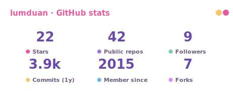
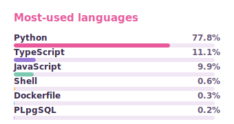

# lumduan

> **Candythink — Complexity Made Sweet**

Hi, I'm lumduan 👋 — I run a one-person quant operation, from data infrastructure to live execution, for **Thai capital markets (SET / TFEX)** and **crypto (Binance, Bitkub)**.

### 🚀 Highlighted work

[`tvkit`](https://github.com/lumduan/tvkit) · [`settfex`](https://github.com/lumduan/settfex) · [`csm-set`](https://github.com/lumduan/csm-set) · [`binance-th`](https://github.com/lumduan/binance-th) · [`thai-securities-data`](https://github.com/lumduan/thai-securities-data)

### 📈 Currently live

[`csm-set`](https://github.com/lumduan/csm-set) — a cross-sectional momentum strategy on the SET, in live testing. *Backtests lie; live P&L doesn't.*

### 📊 Stats

 

---

Always happy to connect → [LinkedIn](https://www.linkedin.com/in/sarat-sonsuk/) · [email](mailto:b@candythink.com)

<!-- candythink · lumduan profile readme -->
